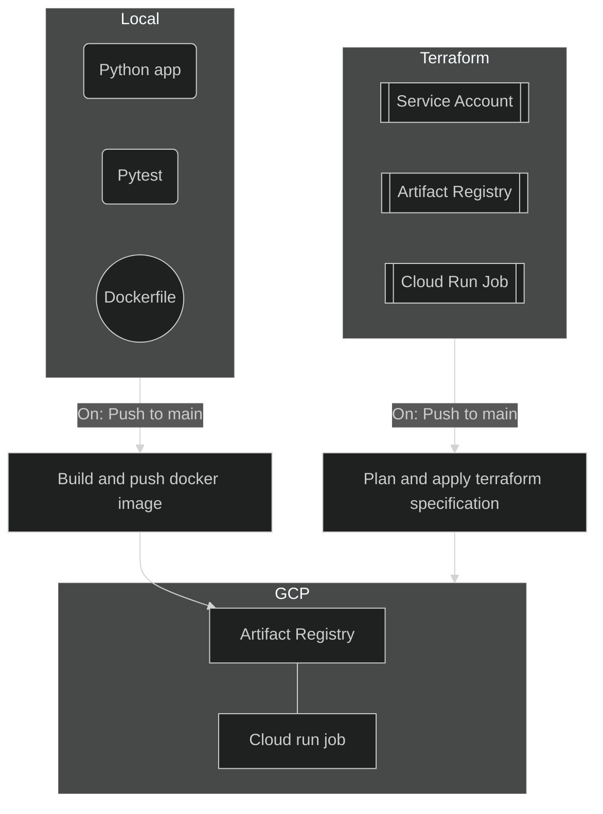

# showcase-CloudFunction

## About
A personal project aimed to further advance my skills with docker, github actions and terraform. The app functionality is very basic as python development isn't the main thing for this project. 

## Schema of project logic 


## Python app
The application consists of two functions. 
1. Randomize and number between 1 and 100. 
2. Square this number and return that as the output of the app. 

Nothing groundbreaking here, and I think it's safe to assume that I may be the first developer to be replaced by AI...

A test is also built in with pytest to assert that the function ``` square-number ``` works as intended. 

## Docker 
The python app is containerized with docker. The ```Dockerfile``` and ``` docker-compose.yml``` specifies this process. 

## Terraform
This spins up a cloud environment where the python app can be run. Service account, artifact registry and a cloud run job is being specified and applied upon push to main. 

## Actions
Three actions are used.

### Pytest
Performs the pytests with every push, regardless of branch. 

### Docker build and run on pull request
With every pull request, we perform these actions to make sure that things work as intended. 

### Deploy app and apply terraform resources
When a pull request has been approved and gets merged into main, we want to update our production environment accordingly. This is being done with terraform and docker. Our GCP environment has been updated.  